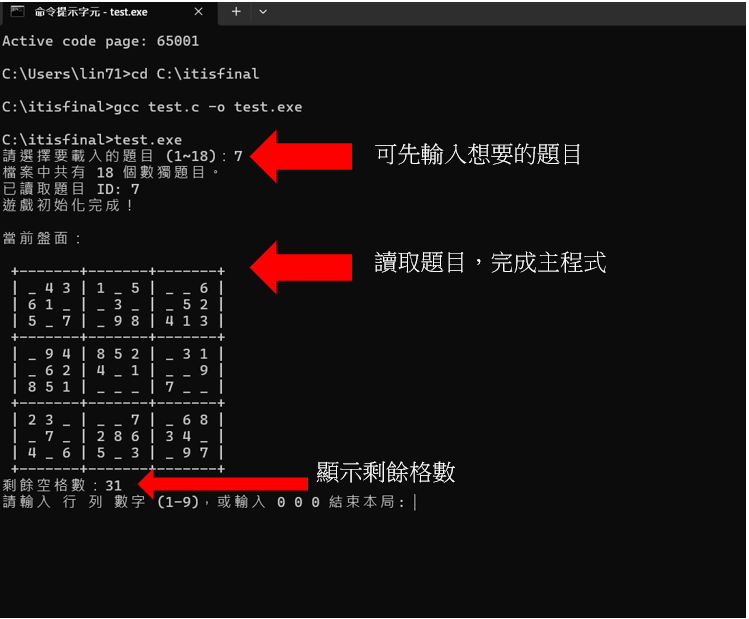

# 0530sudoku報告

## 進度紀錄(數獨遞迴解法)

1. 新增函式，能夠讀取 sudoku.dat 檔案中的不同數獨表盤，並正確顯示盤面。

2. 學習並實作遞迴（recursion）方式解決數獨問題，並成功用程式自動解出盤面。

### 練習1 統計空格數量
```c
int count_empty_cells(int puzzle[][9]) {
    int count = 0;
    for (int i = 0; i < 9; i++) {
        for (int j = 0; j < 9; j++) {
            if (puzzle[i][j] == 0) {
                count++;
            }
        }
    }
    return count;
}
```
### 練習2 驗證數獨合法性
```c
int is_valid_solution(int puzzle[][9]) {
    int check[10];
    // 檢查每一行
    for (int i = 0; i < 9; i++) {
        for (int k = 1; k <= 9; k++) check[k] = 0;
        for (int j = 0; j < 9; j++) {
            int v = puzzle[i][j];
            if (v < 1 || v > 9 || check[v]) return 0;
            check[v] = 1;
        }
    }
    // 檢查每一列
    for (int j = 0; j < 9; j++) {
        for (int k = 1; k <= 9; k++) check[k] = 0;
        for (int i = 0; i < 9; i++) {
            int v = puzzle[i][j];
            if (v < 1 || v > 9 || check[v]) return 0;
            check[v] = 1;
        }
    }
    // 檢查每個 3x3 方格
    for (int boxRow = 0; boxRow < 3; boxRow++) {
        for (int boxCol = 0; boxCol < 3; boxCol++) {
            for (int k = 1; k <= 9; k++) check[k] = 0;
            for (int i = 0; i < 3; i++) {
                for (int j = 0; j < 3; j++) {
                    int v = puzzle[boxRow*3 + i][boxCol*3 + j];
                    if (v < 1 || v > 9 || check[v]) return 0;
                    check[v] = 1;
                }
            }
        }
    }
    return 1;
}
```
## 進度紀錄(增加使用者互動)
1. 在現有程式基礎上增加互動功能
2. 實作簡單的使用者輸入處理
### 完成功能的程式碼 test.c (https://github.com/LINWEICHENG12/itisfinal.git)
### 練習題
1. **一開始詢問要載入哪一個盤面（1~18）**  
2. **增加顯示剩餘空格數**  
3. **當遊戲結束時詢問玩家是否要重新開始**  


## 學習心得
這次專案讓我熟悉了 C 語言檔案操作、遞迴解題、結構體設計與互動式遊戲流程。實作過程中學會了如何用程式自動解數獨、驗證答案、統計空格數，也練習了除錯與版本控制。透過不斷修正與優化，提升了問題解決與專案開發能力。