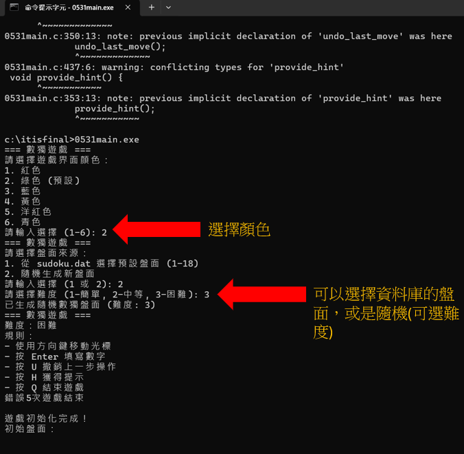
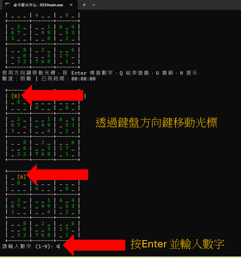
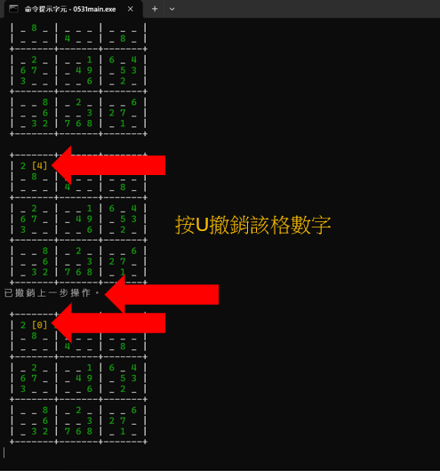
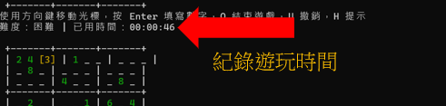
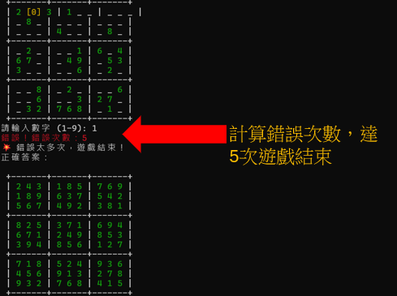
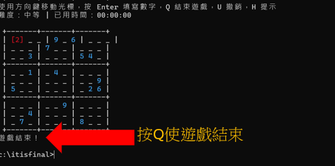

# 數獨專題報告 
電機一甲 11328109 林維成

## 專題摘要

因為先前課堂上本已經有做出大致的架構，本專題主要以提升遊戲體驗、修改先前的bug為主。

此程式玩家可通過方向鍵控制光標移動，並使用數字鍵填寫數獨盤面。遊戲具備完整功能，包括：顏色顯示、方向鍵控制、隨機生成不同難度盤面、從檔案讀取預設盤面、撤銷操作、提示功能、計時功能以及難度顯示等。遊戲採用 C 語言開發，利用回溯法實現數獨解題與生成，並透過 ANSI 轉義序列實現顏色顯示，以 getch() 函數捕捉鍵盤輸入，創造出流暢且互動性強的遊戲體驗。

## 設計過程

### 1. 需求分析
開發初期，確定以下核心需求：
- 建立基本數獨遊戲邏輯
- 提供友善的使用者操作介面
- 支援不同難度的遊戲盤面
- 加入實用功能提升遊戲體驗

### 2. 系統架構設計
將系統分為四個主要模組：
1. **盤面管理模組**：處理數獨盤面的讀取、生成與驗證
2. **遊戲邏輯模組**：實現遊戲核心邏輯，包括填寫數字、檢查答案等
3. **用戶界面模組**：負責顯示盤面、捕捉用戶輸入、提供視覺反饋
4. **輔助功能模組**：實現撤銷、提示、計時等額外功能

### 3. 功能實作

#### 關鍵演算法設計
- **數獨求解演算法**：使用回溯法 (Backtracking) 實現
  - 核心思路：依序嘗試每個空格位置，填入1-9數字並檢查有效性
  - 採用遞迴方式，若當前解法不成立則回溯嘗試其他數字
  - 實現深度優先搜索以找出有效解答

- **隨機數獨生成演算法**：先生成完整解答，再依難度移除不同數量的數字
  - 難度控制機制：
    - 簡單：移除約30-40格
    - 中等：移除約40-50格
    - 困難：移除約50-60格
  - 確保每個生成的盤面均有唯一解

#### 界面設計
- 使用 ANSI 轉義序列實現多彩顯示
- 設計光標控制系統便於用戶操作
- 顯示難度與時間資訊提升遊戲體驗

#### 功能迭代開發
按照優先順序陸續實現以下功能：
1. 基本數獨遊戲邏輯
2. 方向鍵控制與光標顯示
3. 撤銷與提示功能
4. 計時功能
5. 顏色顯示增強
6. 盤面選擇與難度設定
7. 難度顯示功能

## 實作結果

### 1. 核心遊戲功能

#### 1.1 顏色支援
- 使用 ANSI escape codes 實現多彩界面
- 支援紅、綠、藍、黃、洋紅、青色等多種顏色主題
- 不同類型信息使用不同顏色區分：
  - 正確答案：綠色
  - 錯誤提示：紅色
  - 光標位置：黃色

#### 1.2 方向鍵控制
- 使用 `getch()` 捕捉鍵盤輸入，支援方向鍵操作
- 光標位置醒目標示，提升用戶體驗
- 使用特殊字符框選當前位置，增加視覺辨識度

#### 1.3 盤面選擇
- 支援從預設檔案讀取盤面（共18題）
- 支援隨機生成新盤面（3種難度）
- 採用二進位檔案格式儲存預設盤面

#### 1.4 難度系統
- 支援三種難度等級：簡單、中等、困難
- 不同難度移除不同數量的數字：
  - 簡單：移除約 30-40 個數字
  - 中等：移除約 40-50 個數字
  - 困難：移除約 50-60 個數字
- 在遊戲介面中持續顯示當前難度

### 2. 輔助功能

#### 2.1 撤銷功能
- 允許玩家撤銷上一步操作 (按 `U` 鍵)
- 記錄每步操作的座標和數值，方便撤銷
- 若無動作記錄，顯示友善提示

#### 2.2 提示功能
- 玩家可請求提示 (按 `H` 鍵)
- 自動在第一個空格位置填入正確答案
- 提供答案位置與數值的明確說明

#### 2.3 計時功能
- 記錄遊戲開始和結束時間
- 即時顯示已用時間（小時:分鐘:秒格式）
- 完成遊戲時顯示總用時

#### 2.4 輸入檢查與友善提示
- 檢查輸入數字範圍（1-9）
- 防止修改原始數字
- 防止重複填寫同一位置
- 顯示友善的錯誤提示信息

### 3. 程式架構概述

#### 主程式流程
- 初始化環境設定（含中文UTF-8支援）
- 提供顏色主題選擇（紅、綠、藍、黃、洋紅、青色）
- 盤面來源選擇（讀取預設盤面或隨機生成）
- 難度設定（簡單、中等、困難）
- 進入遊戲主流程

#### 遊戲主流程
- 顯示遊戲標題與目前難度
- 顯示遊戲規則與操作說明
- 初始化遊戲盤面（複製原始盤面、計算答案）
- 開始計時並進入互動循環
- 結束遊戲時顯示結果與完成時間

### 4. 功能清單總結

| 功能 | 實現方式 | 按鍵操作 |
|------|----------|---------|
| 顏色支援 | ANSI Escape Codes | 自動顯示 |
| 撤銷上一步 | 維護移動歷史陣列 | U 鍵 |
| 提示功能 | 顯示一個空格的答案 | H 鍵 |
| 輸入檢查 | 檢查數字範圍和位置限制 | 自動檢查 |
| 計時功能 | 使用 time() 函數 | 完成後自動顯示 |
| 方向鍵控制 | 使用 getch() 捕捉按鍵 | ↑↓←→方向鍵 |
| 盤面選擇 | 支援預設或隨機盤面 | 遊戲開始時選擇 |
| 難度顯示 | 在遊戲介面中顯示當前難度 | 自動顯示 |

### 實作結果功能展示

## 心得與反思

### 遇到的困難與解決方法

1. **中文顯示問題**：
   - 問題：在命令提示字元中顯示中文會出現亂碼
   - 解決：使用 `SetConsoleOutputCP(65001)` 設定輸出為 UTF-8

2. **方向鍵捕捉**：
   - 問題：方向鍵產生兩個字元序列，不易處理
   - 解決：連續兩次呼叫 `getch()` 函數，第一次檢測特殊鍵前導碼 -32，第二次取得方向鍵的具體代碼

3. **難度平衡**：
   - 問題：不同難度的盤面需要適當的填入數字數量
   - 解決：根據難度級別動態調整移除數字的數量，並加入小範圍隨機化

4. **數獨生成效率**：
   - 問題：純隨機生成數獨耗時長，且可能無解
   - 解決：先隨機填入少量數字，再使用求解器完成，最後移除適量數字生成題目

### 未來展望

未來可以擴展的功能，可能的方向包括：

1. **圖形使用者介面**：
   - 使用 SDL 或 Qt 等圖形庫開發更現代的界面
   - 添加更豐富的視覺效果和動畫

2. **進階功能**：
   - 實現遊戲存檔與讀檔功能
   - 添加分數系統與排行榜
   - 設計成就系統提高遊戲可玩性

3. **多平台支援**：
   - 優化代碼使其能在不同作業系統上運行
   - 開發手機版本增加觸控操作

4. **網絡功能**：
   - 添加網絡對戰模式
   - 實現雲端存儲個人遊戲數據

### 學習收穫
這次數獨遊戲專案的開發過程讓我獲益良多，不僅提升了 C 語言程式設計能力，並且特別是再Vibe coding的技巧上，在開始請AI寫程式時，會發現其實自己對程式的觀念、了解還是相當重要的，並且對整的程式設計要實現的功能想法以及該念都是要相當的請處，這樣在對AI講述需求時，才不會會錯意。

並且在Vibe Coding的過程中我也發現管理版本紀錄的重要性，因為有時候寫出來的程式碼不一定是正確的、有時候AI會挖了一個大坑，且要再重新作修改通常需要在花上好大一段時間，但如果有了先前版本的程式碼紀錄，在修改起來就會相對輕鬆很多。

這次的專題。我也深刻體會到，儘管 AI 能高效輔助程式開發，但清晰的程式觀念和對需求精準的定義仍是不可或缺的基石，這些寶貴經驗將引導我在未來更有效率地運用 AI 進行程式開發。

